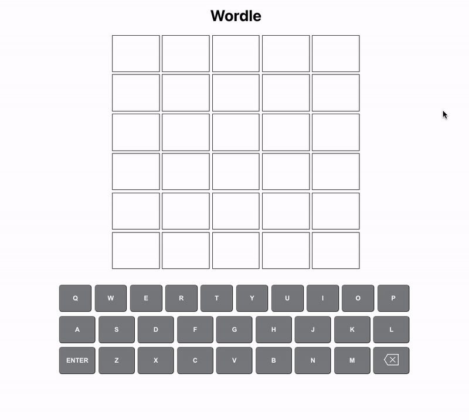

# wordle

Personally have never played `Wordle` before but it was straightforward to learn and play.

### Breakdown of App (Visually):

1. contains title `Wordle` at top of page
2. contains 6 row by 5 column grid
3. keyboard visual near bottom of page

### Breakdown of App (Functionality):

1. User enters letters to create a `5 letter word`

- User should not be able to hit `Enter` unless word contains 5 letters
- User will not be able to enter more than 5 characters
- User must enter a valid word or error is displayed

2. User submits `5` letter word

- User is either correct or wrong
- if letter has a grey background, it means the letter is not in the word
- if letter has a yellow background, letter is in the word but not in the right position
- if letter has a green background, letter is in the word and in the correct position

3. User has 6 attemps to guess the correct word
4. User either loses or wins

### TODOs:

I spent 2 hours and 30 minutes on assignment. Didn't want to go over the 3 hour limit.

1. format keyboard keys to resemble WORDLE
2. change color of keys to match the word guesses
3. add animation to the tiles
4. use pixels instead of `em`/`rem`
5. pull some functions into custom hook
